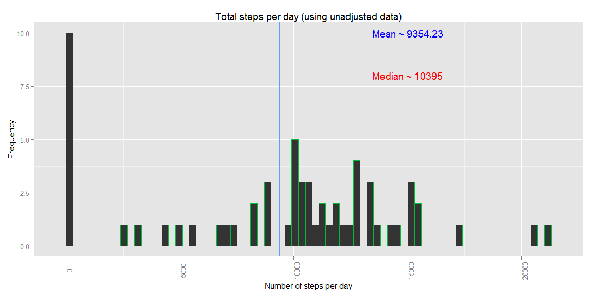
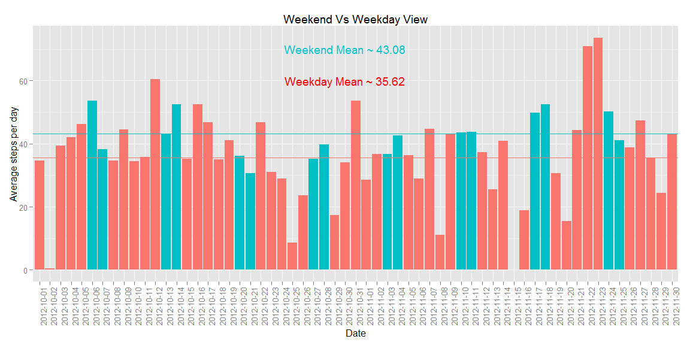
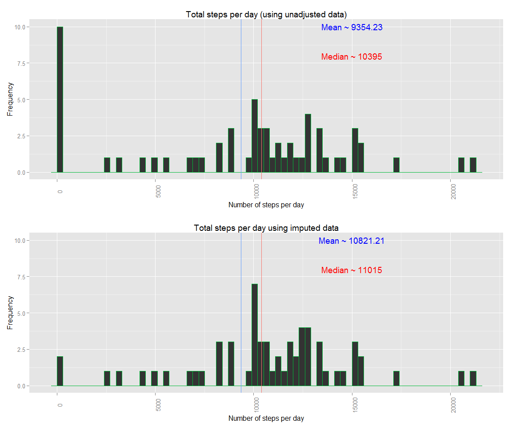
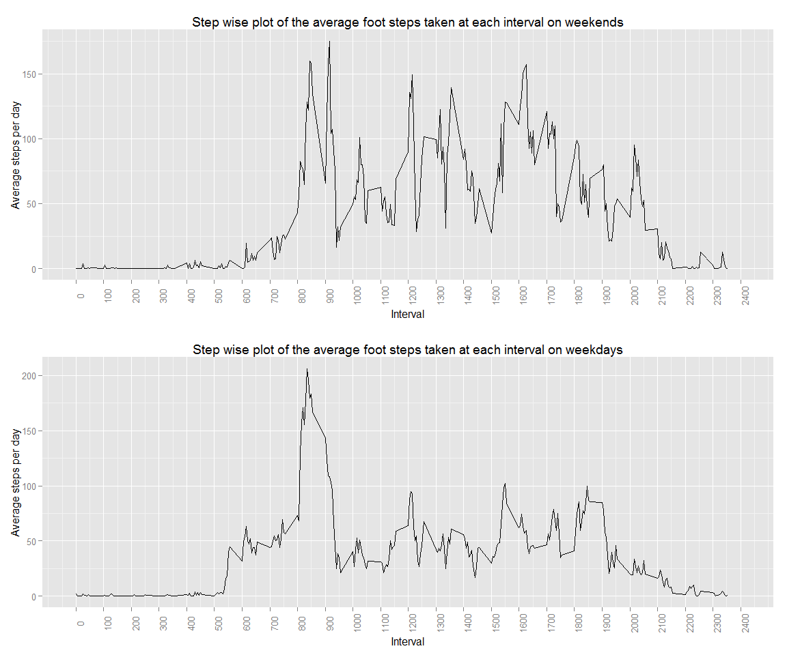

# Reproducible Research: Peer Assessment 1
Trevor  
October 5, 2015  

## Loading and preprocessing the data
Adjust to your own working directory.

```r
setwd("C:\\github\\reproducible_research\\RepData_PeerAssessment1")
options(scipen=999)
```
These are the libraries we will use in this analysis.

```r
require(ggplot2)
require(plyr)
require(lubridate)
require(magrittr)
require(grid)
require(gridExtra)
```

get data set files:
we download the files if necessary and unzip them.
Next we extract the data to a dataframe.

```r
if(!file.exists("activity.csv")){
  if(!file.exists("FNEI_data.zip")){
    download.file("https://d396qusza40orc.cloudfront.net/repdata%2Fdata%2Factivity.zip", "FNEI_data.zip")
  }
  unzip("activity.zip")
}

alldata <- read.csv(file="activity.csv", sep = ",", header = TRUE)
alldata$date <- as.Date(as.POSIXct(alldata$date))
```

## What is mean total number of steps taken per day?
First we are going to sum the steps taken on each day.

```r
totalstepsperday <- as.data.frame(tapply(alldata$steps, alldata$date, FUN=sum, na.rm=TRUE))
colnames(totalstepsperday)[1] <- "totalsteps"
```
Next we will calculate the Mean and median.

```r
meansteps1 <- mean(totalstepsperday$totalsteps,na.rm=TRUE)
mediansteps1 <- median(totalstepsperday$totalsteps,na.rm=TRUE)
```
The raw data mean was 9354.23.<br>
The raw data median was 10395.<br>

Lastly we will do a histogram of the data.

```r
colnames(totalstepsperday)[1] <- "avgstepsperday"
totalstepsperday$date <- rownames(totalstepsperday)

h1 <- ggplot(data=totalstepsperday, aes(x=avgstepsperday, color="green"))+
  geom_histogram(binwidth =300)+
  geom_vline(aes(xintercept=meansteps1, color="red"))+
  geom_vline(aes(xintercept=mediansteps1, color="blue"))+
  xlab("Number of steps per day")+
  ylab("Frequency")+
  annotate(geom="text", x=15000, y=10, 
           label = sprintf("Mean ~ %s", round(meansteps1, digits = 2), nsmall = 0),
           color="blue")+
  annotate(geom="text", x=15000, y=8, 
           label = sprintf("Median ~ %s", round(mediansteps1, digits = 2), nsmall = 0),
           color="red")+
  theme(axis.text.x = element_text(angle=90), legend.position="none")+
  ggtitle("Total steps per day (using unadjusted data)")
h1
```

 

## What is the average daily activity pattern?

```r
avgperinterval <- as.data.frame(tapply(alldata$steps, alldata$interval, FUN=mean, na.rm=TRUE))
colnames(avgperinterval)[1] <- "avgstepsperinterval"
avgperinterval$interval <- as.numeric(rownames(avgperinterval))
maxrow <- subset(avgperinterval, avgstepsperinterval == max(avgperinterval$avgstepsperinterval))

ggplot(data=avgperinterval, aes(x=interval, y=avgstepsperinterval, group=1))+
  geom_line()+
  geom_point(aes(x=maxrow$interval, y=maxrow$avgstepsperinterval, color = "red"))+
  xlab("Interval")+
  ylab("Average steps per day")+
  scale_x_continuous(limits=c(0, 2400), breaks = seq(0, 2400, by = 100))+
  theme(axis.text.x = element_text(angle=90), legend.position="none")+
  ggtitle("Step wise plot of the average foot steps taken at each interval")
```

 
The peak interval is signified by the red dot on the graph.  The peak occurs at the 835 interval and is 206.17 steps.

## Imputing missing values
To replace the missing values we are going to assume that the device was either
malufunctioning or the user forgot to wear it.  THerefore, we are going to replace
NA values with the average value of the interval at which point the NA occured.  
Taking this a bit further, we are going to assume that average behavior occurred on
the same day of week as well.  So we will be taking the average interval for the 
day of the week and applying that to the unknown value.

```r
alldata$weekday <- wday(alldata$date, label = TRUE)
alldatamon <- subset(alldata, weekday == "Mon")
alldatatues <- subset(alldata, weekday == "Tues")
alldatawed <- subset(alldata, weekday == "Wed")
alldatathurs <- subset(alldata, weekday == "Thurs")
alldatafri <- subset(alldata, weekday == "Fri")
alldatasat <- subset(alldata, weekday == "Sat")
alldatasun <- subset(alldata, weekday == "Sun")
daylist <- list(alldatamon, alldatatues, alldatawed, alldatathurs, alldatafri, alldatasat, alldatasun)

f1 <- function(x) {
  avgperinterval <- as.data.frame(tapply(x$steps, x$interval, FUN=mean, na.rm=TRUE))
  colnames(avgperinterval)[1] <- "avgstepsperinterval"
  avgperinterval$interval <- rownames(avgperinterval)
  tday <- x$weekday[1]
  avgperinterval$day <- rep(tday, length(avgperinterval))
  return(avgperinterval)
}

avgperdayperinterval <- ldply(.data = daylist, .fun = f1)  

for (i in 1:nrow(alldata)){
  if(is.na(alldata[i,"steps"])==TRUE){
    inter <- alldata[i,"interval"]
    tdat <- alldata[i,"weekday"]
    temp <- subset(avgperdayperinterval, interval == inter) %>% subset(day == tdat)
    alldata[i,"steps"] <- temp$avgstepsperinterval
  }
}


totalstepsperday <- as.data.frame(tapply(alldata$steps, alldata$date, FUN=sum, na.rm=TRUE))
colnames(totalstepsperday)[1] <- "totalsteps"
```
We are going to recalculate the mean and median steps using the imputed data and compare it to the non imputed data and then plot it

```r
meansteps2 <- mean(totalstepsperday$totalsteps,na.rm=TRUE)
mediansteps2 <- median(totalstepsperday$totalsteps,na.rm=TRUE)
```
Lastly, we will create a histogram based on the new data and compare it to the non imputed data

```r
colnames(totalstepsperday)[1] <- "avgstepsperday"
totalstepsperday$date <- rownames(totalstepsperday)

h2 <- ggplot(data=totalstepsperday, aes(x=avgstepsperday, color="green"))+
  geom_histogram(binwidth =300)+
  geom_vline(aes(xintercept=meansteps1, color="red"))+
  geom_vline(aes(xintercept=mediansteps1, color="blue"))+
  xlab("Number of steps per day")+
  ylab("Frequency")+
  annotate(geom="text", x=15000, y=10, 
           label = sprintf("Mean ~ %s", round(meansteps2, digits = 2), nsmall = 0),
           color="blue")+
  annotate(geom="text", x=15000, y=8, 
           label = sprintf("Median ~ %s", round(mediansteps2, digits = 2), nsmall = 0),
           color="red")+
  theme(axis.text.x = element_text(angle=90), legend.position="none")+
  ggtitle("Total steps per day using imputed data")

grid.arrange(h1, h2)
```

 
The raw data mean was 9354.23.<br>
The imputed data mean was 10821.21.<br>
The difference in means is 1466.98.

The raw data median was 10395<br>
The imputed median mean was 11015<br> 
The difference in median is 620<br>

The impact of the imputing the data is suttle but noticable.  Imputing the data does not appear to change the patterns very much, however it does reinforce them.  

## Are there differences in activity patterns between weekdays and weekends?
Were going to use the imputed values for this section.
We are also going to subset the tables into weekdays and weekends and take the means.

```r
weekenddata <- alldata[alldata$weekday == "Sat" | alldata$weekday == "Sun",]
weekdaydata <-  alldata[!(alldata$weekday == "Sat" | alldata$weekday == "Sun"),]

#start with weekend
wendtotalstepsperday <- as.data.frame(tapply(weekenddata$steps, weekenddata$interval, FUN=mean, na.rm=TRUE))
colnames(wendtotalstepsperday)[1] <- "totalsteps"

wendmeansteps1 <- mean(wendtotalstepsperday$totalsteps,na.rm=TRUE)
wendmediansteps1 <- median(wendtotalstepsperday$totalsteps,na.rm=TRUE)

wendtotalstepsperday <- as.data.frame(tapply(weekenddata$steps, weekenddata$interval, FUN=mean, na.rm=TRUE))
colnames(wendtotalstepsperday)[1] <- "avgstepsperinterval"
wendtotalstepsperday$interval <- as.numeric(rownames(wendtotalstepsperday))
```
Finally, two stepwise plots will be drawn to compare the weekend and weekday data.

```r
g1 <- ggplot(data=wendtotalstepsperday, aes(x=interval, y=avgstepsperinterval, group=1))+
  geom_line()+
  xlab("Interval")+
  ylab("Average steps per day")+
  scale_x_continuous(limits=c(0, 2400), breaks = seq(0, 2400, by = 100))+
  theme(axis.text.x = element_text(angle=90))+
  ggtitle("Step wise plot of the average foot steps taken at each interval on weekends")

#Now with weekday
wdaytotalstepsperday <- as.data.frame(tapply(weekdaydata$steps, weekdaydata$interval, FUN=mean, na.rm=TRUE))
colnames(wdaytotalstepsperday)[1] <- "totalsteps"

wdaymeansteps1 <- mean(wdaytotalstepsperday$totalsteps,na.rm=TRUE)
wdaymediansteps1 <- median(wdaytotalstepsperday$totalsteps,na.rm=TRUE)

wdaytotalstepsperday <- as.data.frame(tapply(weekenddata$steps, weekenddata$interval, FUN=mean, na.rm=TRUE))
colnames(wdaytotalstepsperday)[1] <- "avgstepsperinterval"
wdaytotalstepsperday$interval <- as.numeric(rownames(wdaytotalstepsperday))

g2 <- ggplot(data=avgperinterval, aes(x=interval, y=avgstepsperinterval, group=1))+
  geom_line()+
  xlab("Interval")+
  ylab("Average steps per day")+
  scale_x_continuous(limits=c(0, 2400), breaks = seq(0, 2400, by = 100))+
  theme(axis.text.x = element_text(angle=90))+
  ggtitle("Step wise plot of the average foot steps taken at each interval on weekdays")
grid.arrange(g1, g2)
```

 

The weekend mean for the intervals is 43.08<br>
The weekday mean for the intervals is 35.62<br>
The difference is 7.46<br>

The weekend median for the intervals is 32.04<br>
The weekday median for the intervals is 24.23<br>
The difference is 7.81<br>

There is a difference between the weekend actvity and the weekday activity that appears to be significant.  It is obvious from the graphs.  THe mean and media are also different as well.  The mean and median for the weekend is higher. However, I have not done the statistical analysis to determine if it is actually statistically signaficant.  
