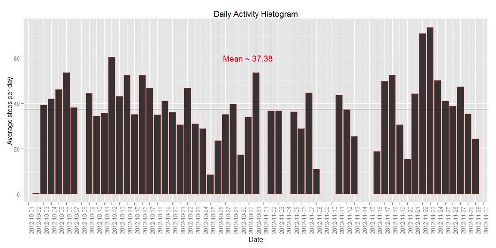

# Reproducible Research: Peer Assessment 1
Trevor  
September 18, 2015  

## Loading and preprocessing the data
adjust to your own working directory

```r
setwd("C:\\github\\reproducible_research\\RepData_PeerAssessment1")
```
get data set files:
we download the files if necessary and unzip them
next we extract the data to a dataframe

```r
if(!file.exists("activity.csv")){
  if(!file.exists("FNEI_data.zip")){
    download.file("https://d396qusza40orc.cloudfront.net/repdata%2Fdata%2Factivity.zip", "FNEI_data.zip")
  }
  unzip("activity.zip")
}

alldata <- read.csv(file="activity.csv", sep = ",", header = TRUE)
alldata$date <- as.Date(as.POSIXct(alldata$date))
```

## What is mean total number of steps taken per day?
using the mean function we calculate the mean for each day ignoring NA

```r
meansteps1 <- mean(alldata$steps,na.rm=TRUE)
meansteps1
```

```
## [1] 37.3826
```

## What is the average daily activity pattern?

```r
require(ggplot2)
```

```
## Loading required package: ggplot2
```

```r
avgperday <- as.data.frame(tapply(alldata$steps, alldata$date, FUN=mean, na.rm=TRUE))
colnames(avgperday)[1] <- "avgstepsperday"
avgperday$date <- rownames(avgperday)

ggplot(data=avgperday, aes(x=date, y=avgstepsperday, color="red"))+
  geom_histogram(stat="identity")+
  geom_hline(y=meansteps1)+
  xlab("Date")+
  ylab("Average steps per day")+
  annotate(geom="text", x=30, y=60, 
           label = sprintf("Mean ~ %s", round(meansteps1, digits = 2), nsmall = 0),
           color="red")+
  theme(axis.text.x = element_text(angle=90), legend.position="none")+
  ggtitle("Daily Activity Histogram")
```

```
## Warning: Removed 8 rows containing missing values (position_stack).
```

 

## Imputing missing values
to replace the missing values we are going to assume that the device was either
malufunctioning or the user forgot to wear it.  THerefore, we are going to replace
NA values with the average value of the interval at which point the NA occured.  
Taking this a bit further, we are going to assume that average behavior occurred on
the same day of week as well.  So we will be taking the average interval for the 
day of the week and applying that to the unknown value.
Interestingly enough, the means only changed slightly.

```r
require(plyr)
```

```
## Loading required package: plyr
```

```r
require(lubridate)
```

```
## Loading required package: lubridate
## 
## Attaching package: 'lubridate'
## 
## The following object is masked from 'package:plyr':
## 
##     here
```

```r
require(magrittr)
```

```
## Loading required package: magrittr
```

```r
alldata$weekday <- wday(alldata$date, label = TRUE)
alldatamon <- subset(alldata, weekday == "Mon")
alldatatues <- subset(alldata, weekday == "Tues")
alldatawed <- subset(alldata, weekday == "Wed")
alldatathurs <- subset(alldata, weekday == "Thurs")
alldatafri <- subset(alldata, weekday == "Fri")
alldatasat <- subset(alldata, weekday == "Sat")
alldatasun <- subset(alldata, weekday == "Sun")
daylist <- list(alldatamon, alldatatues, alldatawed, alldatathurs, alldatafri, alldatasat, alldatasun)

f1 <- function(x) {
  avgperinterval <- as.data.frame(tapply(x$steps, x$interval, FUN=mean, na.rm=TRUE))
  colnames(avgperinterval)[1] <- "avgstepsperinterval"
  avgperinterval$interval <- rownames(avgperinterval)
  tday <- x$weekday[1]
  avgperinterval$day <- rep(tday, length(avgperinterval))
  return(avgperinterval)
  }

avgperdayperinterval <- ldply(.data = daylist, .fun = f1)  

for (i in 1:nrow(alldata)){
  if(is.na(alldata[i,"steps"])==TRUE){
    inter <- alldata[i,"interval"]
    tdat <- alldata[i,"weekday"]
    temp <- subset(avgperdayperinterval, interval == inter) %>% subset(day == tdat)
    alldata[i,"steps"] <- temp$avgstepsperinterval
  }
}

avgperday <- as.data.frame(tapply(alldata$steps, alldata$date, FUN=mean, na.rm=TRUE))
colnames(avgperday)[1] <- "avgstepsperday"
avgperday$date <- rownames(avgperday)
```
We are going to recalculate the mean steps using the imputed data and compare it to the non imputed data and then plot it

```r
meansteps2 <- mean(alldata$steps,na.rm=TRUE)
meansteps2
```

```
## [1] 37.57364
```

```r
# the differnce between the means
meansteps2 - meansteps1
```

```
## [1] 0.1910449
```

```r
require(ggplot2)
ggplot(data=avgperday, aes(x=date, y=avgstepsperday, color="red"))+
  geom_histogram(stat="identity")+
  geom_hline(y=meansteps2)+
  xlab("Date")+
  ylab("Average steps per day")+
  annotate(geom="text", x=30, y=60, 
           label = sprintf("Mean ~ %s", round(meansteps2, digits = 2), nsmall = 0),
           color="red")+
  theme(axis.text.x = element_text(angle=90), legend.position="none")+
  ggtitle("Histogram using Imputed Data")
```

 

## Are there differences in activity patterns between weekdays and weekends?
were going to use the imputed values for this section
Were are going to subset the tables into weekdays and weekends and take the means
We will then plot them using different colors

```r
avgperday$weekday <- wday(avgperday$date, label = TRUE)

weekenddata <- avgperday[avgperday$weekday == "Sat" | avgperday$weekday == "Sun",]
weekdaydata <-  avgperday[!(avgperday$weekday == "Sat" | avgperday$weekday == "Sun"),]

weekendmean <- mean(weekenddata$avgstepsperday,na.rm=TRUE)
weekdaymean <- mean(weekdaydata$avgstepsperday,na.rm=TRUE)
#difference in the means
weekendmean - weekdaymean
```

```
## [1] 7.461965
```

```r
weekenddata$col <- rep("Green", nrow(weekenddata))
weekdaydata$col <- rep("Blue", nrow(weekdaydata))

avgperdaycol <- weekdaydata %>% rbind.data.frame(weekenddata)

require(ggplot2)
ggplot(data=avgperdaycol, aes(x=date, y=avgstepsperday, fill=avgperdaycol$col), binwidth =1)+
  geom_histogram(stat="identity")+
  geom_hline(aes(yintercept=weekendmean, color="turquoise3"))+
  geom_hline(aes(yintercept=weekdaymean, color="orangered"))+
  xlab("Date")+
  ylab("Average steps per day")+
  annotate(geom="text", x=30, y=70, 
           label = sprintf("Weekend Mean ~ %s", round(weekendmean, digits = 2), nsmall = 0),
           color="turquoise3")+
  annotate(geom="text", x=30, y=60, 
           label = sprintf("Weekday Mean ~ %s", round(weekdaymean, digits = 2), nsmall = 0),
           color="red")+
  theme(axis.text.x = element_text(angle=90), legend.position="none")+
  ggtitle("Weekend Vs Weekday View")
```

 

## Conclusion
There is a difference between the weekend actvity and the weekday activity that appears to be significant.  However, I have not done the statistical analysis to determine if it is.
